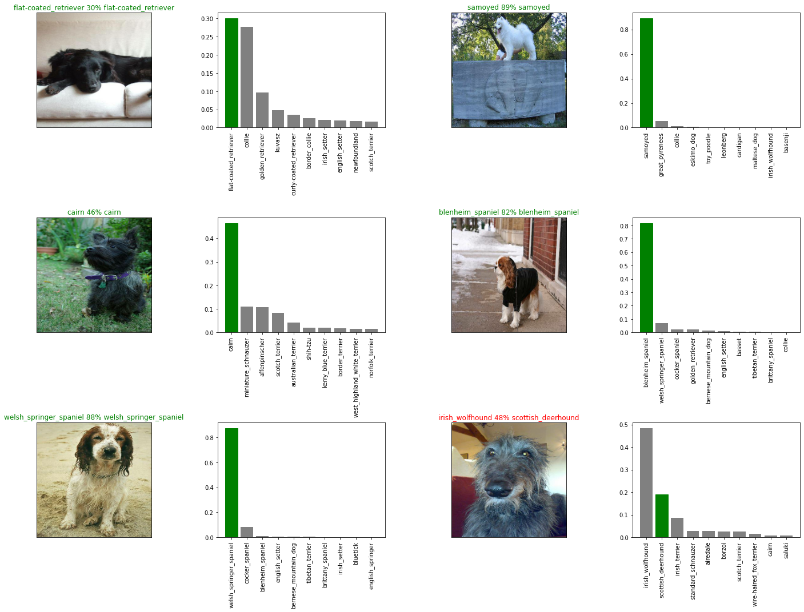

# Dog Vision Classification Project

This repository contains the Jupyter Notebook `dog_vision_classification.ipynb` which is a step-by-step guide to building a TensorFlow model for classifying dog images using deep learning techniques. The notebook covers various stages of the project, from data preprocessing to model creation and evaluation.

## Table of Contents

- [Introduction](#introduction)
- [Project Overview](#project-overview)
- [Getting Started](#getting-started)
- [Data Preprocessing](#data-preprocessing)
- [Model Creation](#model-creation)
- [Model Evaluation](#model-evaluation)

## Introduction

In this project, The goal is to create a powerful deep learning model capable of categorizing dog images into distinct classes. We'll dive into the intricacies of data preprocessing, construct a robust TensorFlow model, and thoroughly evaluate its performance.

## Project Overview

The project is structured as follows:

1. **Data Checking**: Initiating involves validating the existence of image files corresponding to paths listed in the provided CSV file.

2. **Label Conversion**: The process involves converting labels from the dataset into a numpy array to facilitate further processing.

3. **Boolean Label Conversion**: To adapt for multi-class classification, each label is converted into a Boolean array.

4. **Data Setup**: The data is organized into two variables: `x` for filenames and `y` for boolean labels.

5. **Data Split**: The dataset is divided into an 80% training set and a 20% validation set.

6. **Image Preprocessing Function**: A function is defined for image preprocessing, which involves reading image files, converting them into numerical tensors with RGB channels, scaling color values to a range of 0 to 1, and resizing images to the desired dimensions, such as 244x244.

7. **Tuple Creation Function**: Another function generates tuples containing images and corresponding labels. This function takes image file paths and associated labels, processes the images using the preprocessing function, and returns tuples.

8. **TensorFlow Model**: Utilizing TensorFlow, a deep learning model is constructed with a defined architecture (details in the notebook).

9. **Model Training and Evaluation**: The model is compiled with loss and accuracy metrics. It's then trained using the training dataset and evaluated on the validation set.

## Model Evaluation

After compiling the model with specific loss and accuracy metrics, the model's performance is evaluated using the validation dataset. The evaluation metrics offer valuable insights into the model's effectiveness and pinpoint areas that may require refinement.

### Evaluation Metrics

After training, the model achieved remarkable results:

- **Loss:** 0.0142
- **Accuracy:** 99.86%

### Visualizing Model Performance

Visual representation of the model's performance can be seen in the image below:

For a more comprehensive understanding of the project's implementation, detailed code explanations, and insights, please refer to the `dog_vision_classification.ipynb` notebook located in this repository.
